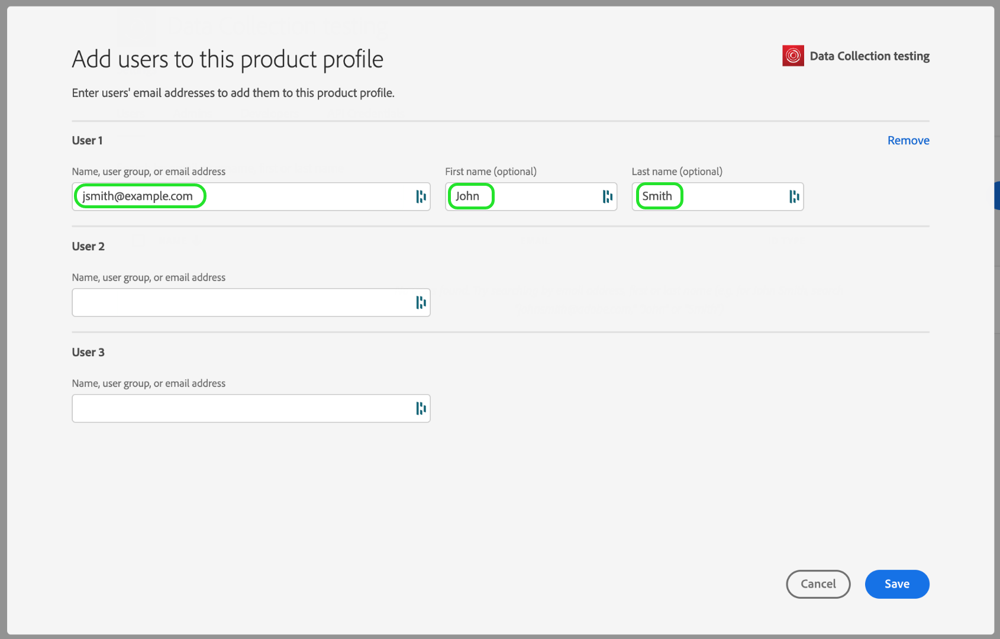

# Grant user access

Before you get started with your extension_package, you need to set up your team members with user accounts and permissions.  This is accomplished in the [Adobe Admin Console](https://adminconsole.adobe.com/).

This document provides steps for granting access to Adobe Experience Platform Data Collection tags through the Admin Console.

## Prerequisites

This guide assumes you are an Organization Admin as designated by the Admin Console. If you require additional information about the Admin Console and assigning roles, refer to the following resources:

* [Administration user guide](https://helpx.adobe.com/enterprise/administering/user-guide.html?topic=/enterprise/administering/morehelp/introduction.ug.js): Information about all things in the Admin Console
* [Enterprise administration roles](https://helpx.adobe.com/au/enterprise/using/admin-roles.html): More about the different types of administration roles. For the guide below, we'll assume you are an Org Admin.

## Choose Your Organization

Your Adobe Experience Cloud organization administrator should sign in to the [Admin Console](https://adminconsole.adobe.com/). The first screen is the Overview:

Some of you may have access to more than one Organization. In order to add the tags product to the correct Org, select the name of the Organization you see in the upper right corner of the screen, then choose the one where you want to use Data Collection tags:

## Create a Product Profile

A Product Profile is a group.  Individual rights are assigned to product profiles and any users in the profile will inherit those rights.

Choose the "Products" link at the top, and "Experience Cloud" on the left. If you do not have Adobe Experience Platform Data Collection listed, customers should contact their account team and partners should email <ExchangeTechEC@adobe.com>.

The screenshot above shows an example Profile, you may not have one yet. To create one, select the blue "New Profile" button. On the Create a New Profile screen, just add a Profile Name (Data Collection testing, for example), and an optional Description, then select Save:

Now that we have the Product Profile in our Organization, let's add our users.

## Assign Users to the Product Profile

Notice that the Product Profile shows zero for Entitled Users and Admins. Select the name of the Product Profile you created (Data Collection testing in our example):

Select the Users tab. Here you can search for existing Adobe ID users by email, or add new users to this Product Profile. Select the blue Add User link.

Enter a name, user group or email address in the appropriate text field. It is recommended to include a first and last name where possible. Select Save to you add the user.

When you have all the users you need in this Product Profile, we'll add Permissions for them. Select the Permissions tab. On the Permissions screen you'll see PROPERTIES, COMPANY RIGHTS, and PROPERTY RIGHTS. Select Edit and complete the following instructions for both Company Rights and Property Rights.

To author extensions, you and your team need - at a minimum - `Manage Properties` from the Company group as well as `Manage Extensions`, `Manage Environments`, and `Develop` from the Property group. You can create additional Product Profiles with more limited rights later if you like, but for now, it is simplest to select "+ Add all" for both Company Rights and Property Rights, being sure to select "Save" on each:

So far, we have chosen the appropriate Organization, created a Product Profile, added Users to the product profile, and assigned permissions.

This completes the required setup in the Administration Console! You and your team members that have been set up as users can now sign in to [Data Collection tags](https://launch.adobe.com/).

## Confirm Provisioning

After your company is provisioned with access to Adobe Experience Platform Data Collection and your users are set up as described above, you should be able to access the [tags](https://launch.adobe.com/) production environment. If you have been provisioned for Data Collection tags and have completed the Admin Console steps above, but still cannot sign in to [tags](https://launch.adobe.com/), please contact your Adobe support representatives.
