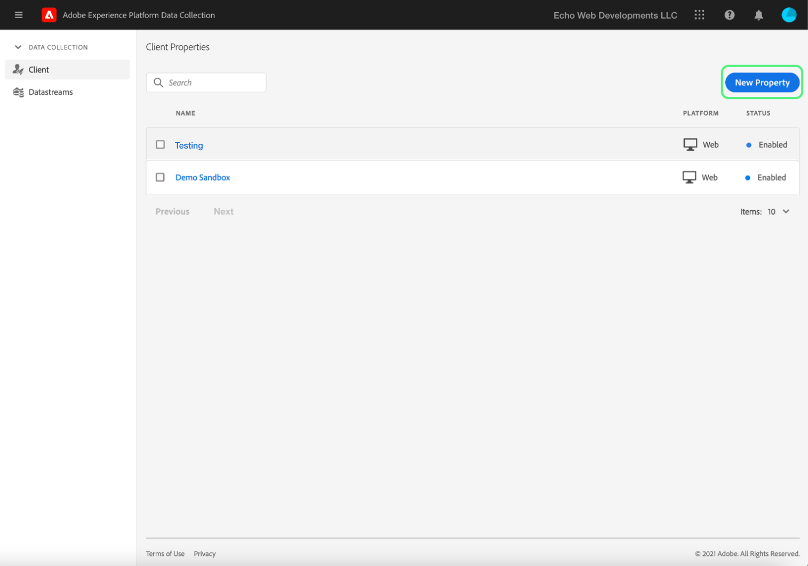
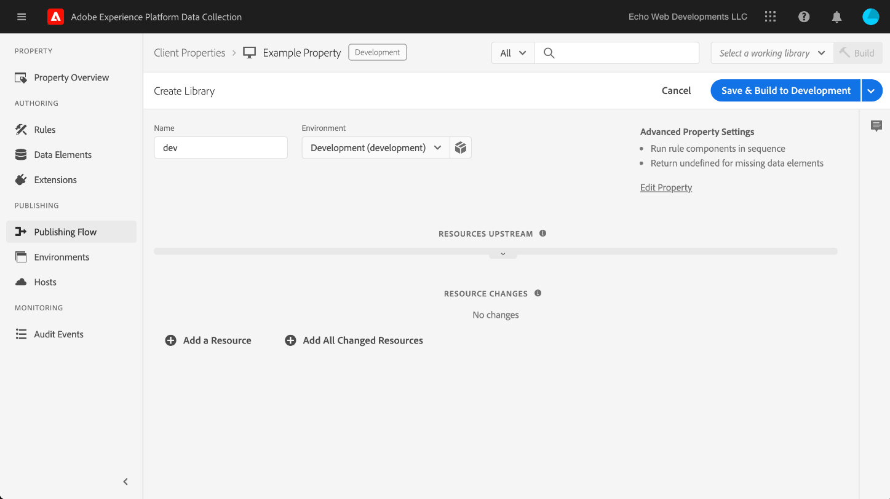

# Upload and implement end-to-end testing

Testing extensions involves using the Adobe Experience Platform Data Collection tags API and/or command-line tools to upload your extension packages, then using the Data Collection UI to install your extension package to a property and exercise its capabilities inside a Data Collection tags library and build.

As we walk through the steps below, we'll assume you're using Mac OS with node and npm installed and available.

## Validate your extension {#validate}

Once your team is satisfied with the performance of your extension and the results they see in the [Sandbox](https://www.npmjs.com/package/@adobe/reactor-sandbox#running-the-sandbox) tool, you should be ready to upload your extension package to Data Collection tags. 

Before uploading, please validate that any required fields or settings are present. For example, reviewing your [extension manifest](../manifest.md), your [extension configuration](../configuration.md), your [views](../web/views.md), and your [library modules](../web/format.md) (at a minimum) would be good practice. 

A specific example is your logo file:  Add an `"iconPath": "example.svg",` line to your `extension.json` file and include that logo image file in your project. This is the relative path to the icon that will be displayed for the extension within Data Collection. It should not begin with a slash. It must reference an SVG file with a `.svg` extension. The SVG should appear normally when rendered square and may be scaled by our user interface. See [How to Scale SVG](https://css-tricks.com/scale-svg/) for more details.

>[!NOTE]
>
>For public extensions, please include an item in your `extension.json` with a link to your Exchange listing. Your [extension manifest](../manifest.md) should include an entry like this: `"exchangeUrl":"https://www.adobeexchange.com/experiencecloud.details.12345.html"` pointing to the URL of your Exchange listing.

## Create an Adobe I/O integration {#integration}

In order to use the API or command-line tools, you need a technical account with Adobe I/O .  We'll create the technical account in the I/O console and then we'll use the Uploader tool to upload the extension package.

For information on creating a technical account for use with Data Collection, please refer to the [Access Tokens](https://developer.adobelaunch.com/api/guides/access_tokens/) guide.

>[!IMPORTANT]
>
>In order to create an Integration in Adobe I/O you must be an Experience Cloud Organization Administrator or an Experience Cloud Org Developer.

If you cannot create an Integration, you probably don't have the correct permissions and need to speak with one of your Org Admins to complete the steps for you or to assign you as a Developer so you can do it yourself.

## Upload Your extension package {#upload}

With your credentials sorted out, you're now ready to test your extension package end-to-end.

When you first upload your extension package, it goes into a state of `development`.  This means that it is only visible with your own Data Collection tags company and only with a property that has been marked for extension development (more on this later).

For now, go back to the command line within the directory that contains your .zip package.

```bash
npx @adobe/reactor-uploader
```

`npx` allows you to download and run an npm package without actually installing it on your machine.  This is the simplest way to run the Uploader.

The Uploader will ask you to input several pieces of information.  The technical account ID, API key, and other bits of information can be retrieved from the Adobe I/O console.  Navigate to the [Integrations page](https://console.adobe.io/integrations) in the I/O console.  Select the correct Org from the dropdown, find the right integration, and select **[!UICONTROL View]**.

* What is the path to your private key? /path/to/private.key. This is the place you saved your private key in step 2 above.
* What is your Org ID? Copy/paste this from the I/O Console overview page that you left open earlier.
* What is your technical account ID? Copy/paste from I/O Console.
* What is your API key? Copy/paste from I/O Console.
* What is the client secret? Copy/paste from I/O console.
* What is the path to the extension_package you want to upload? /path/to/extension_package.zip.  If you invoke the uploader from within the directory containing your .zip package, you can just select it from the list instead of typing the path.

Your extension package will then be uploaded and the uploader will give you the ID of the extension_package.

>[!NOTE]
>
>When uploading or patching, extension packages are placed into a pending state while the system asynchronously extracts the package and deploys. While this process is taking place, you can poll the `extension_package` ID for its status using the API and within Data Collection tags. You will see an extension card in the catalog marked as Pending.

>[!NOTE]
>
>If you plan to run the uploader often, putting all this information in each time can be a burden. You can also pass these in as arguments from the command line.  Check out the [Command Line Arguments section](https://www.npmjs.com/package/@adobe/reactor-uploader#command-line-arguments) of the NPM docs for more info.

## Create a development property {#property}

When you sign in to Data Collection you'll see the Properties screen first.  A property is a container for the tags that you want to deploy and it can be used on one or many sites.



You see 'AEP' and my 'Demo Sandbox' property here but you won't see any properties on your screen the first time you sign in. Select **New Property** to create one. Enter a name and a URL. You'll probably want to use the URL of your test site or the page where you'll be testing your extension. This domain field can be used by some extensions or by a condition using the Core extension (which we'll look at later). Note that `localhost` won't work, so if you're on a `localhost` URL, just use any value for this testing, like example.com.

Because you want to use this property for extension development testing, you also need to expand the Advanced Options and make sure to check the box for "Configure for extension development".


Select **Save** at the bottom to save your new property.

This brings you back to the Properties screen. Select the name of your property that you just created. This is the Overview screen in a property. Not much work happens here, but there are links to each area of the system, with the global navigation links at the top.

## Install your extension {#install-extension}

To install your extension in this property, select the **Extensions** link in the main navigation links at the top. You'll see the **Core** extension on this **Installed** screen. The Core extension contains all the tag management functionality within Data Collection.


To add your extension, select the **Catalog**:


The catalog displays card icons for each available extension. If your extension isn't displayed in the catalog, be sure you completed the steps above in the Adobe Administration Console Set Up and Creating Your Extension Package sections above first.  Your extension package may also show up as Pending if Adobe Experience Platform Data Collection hasn't completed the initial processing.

If you are convinced you've done everything correctly, and you still don't see a Pending or Failed extension package in the catalog, you may want to hit the API directly to check the status of your extension package.  For more info on that, please read [Get an ExtensionPackage](https://developer.adobelaunch.com/api/reference/1.0/extension_packages/fetch/) in the API docs.

Assuming that your extension package has finished processing, the card here will have an **Install** button for you to select:


This will bring up the configuration screen you built for your extension (if you have one). Add any information needed to configure your extension and select **Save** at the bottom. Here's an example of the configuration screen using the Facebook extension which requires a Pixel ID.


You should now see the **Installed** extensions screen with the Core extension and your extension.


## Create resources to test your extension {#resources}

Extensions provide new capabilities to users of Adobe Experience Platform Data Collection tags. These almost always show up in Data Elements or the Rule Builder. We'll discuss both of these areas next.

### Data elements

Data elements exist in Data Collection tags to help users persist values. Each data element is a mapping or pointer to source data. A single data element is a variable that can be mapped to query strings, URLs, cookie values, JavaScript variables, etc. Select **Data Elements** from the left navigation bar, and **Create New Data Element**.


Extensions can define data element types if needed for your extension to operate, or simply as a convenience to users. When an extension provides data element types, they appear in a dropdown list for users on the Create New Data Element screen:


When a user selects your extension from the Extension dropdown, the Data Element Type dropdown is populated with any data element types supplied by your extension. The user can then map each data element to its source value. Data elements can then be used when building rules in the Data Element Change Event or Custom Code Event to trigger a rule to execute. A data element can also be used in the Data Element Condition or other Conditions, Exceptions, or Actions in a rule.

Once the data element is created (the mapping is set up), users can reference the source data simply by referencing the data element. If the source of the value ever changes (site re-designs, etc.) users only need to update the mapping once in Data Collection and all the data elements will automatically receive the new source value.

### Rules

Select the **Rules** link in the left navigation, then **Create New Rule**:


First, name the rule, any name is fine. The Create New Rule screen is set up like an `if-then` statement:


If an event occurs, and conditions pass, and there are no exceptions, the action is triggered. This same flow exists in extensions where you can create or leverage events, conditions, exceptions, data elements, or actions.

Continuing with the Facebook example, let's add an event for any time a page loads on our site:


With the `Window Loaded` Event Type, any time a page loads on our site this rule will be triggered. Select **Keep Changes**. For this example, let's skip Conditions and Exceptions as we want this rule triggered for any page on our site - our "global" On Load rule so to speak.

Under Actions select **Add**. On this Action Configuration screen, we can choose the extension we want to work with and the action we want to occur when this rule is triggered. Let's choose the **Facebook Pixel** under Extension, and **Send Page View** under Action Type:


Select **Keep Changes** at the bottom, and **Save** on the next screen. When testing your extension, you can select any events, conditions, etc. supplied by your extension in any number of rules.

## Publish your changes {#publish}

In the main navigation, select **Publishing**, then on **Add New Library** link:


A library is a set of instructions for how extensions, data elements, and rules will interact with one another and with a website. Libraries are compiled into builds. A library can contain as many changes as a user is comfortable making or testing at once.

On the Create New Library screen, add a Name and choose an Environment. Data Collection tags provide a default development environment helpfully named `Development`, so select that one from the Environment list.  For now, we'll add all available resources, so select **Add All Changed Resources**.

>[!NOTE]
>
>When you add a resource to a library, a snapshot of that resource as of that exact moment is taken and added to the library.  When you make changes to your resources later (for example, as a result of fixes you need to make), you'll need to also update the library to include the latest changes to your resources.  The **Add All Changed Resources** button is useful for this purpose as well.



Then select **Save** at the bottom. Now that we have all our changes included in this `dev` library, let's build it:


After the build process completes, you should see a green **success** indicator next to the library name:


The Data Collection tags library is now published and waiting to be used.  We now need to tell our test page to look for this library so we can test the behavior for the end-user in a browser.

## Install Data Collection tags on a test site {#install-data-collection-tags}

Installation instructions are available from the Environments tab, so let's navigate there now.  

On this page, you'll see all available environments and you have the ability to create more.  We published our library to the Development environment, so let's get the installation instructions for that Environment by selecting the box icon in the Install column on the Development row.


We're now looking at the installation instructions for the Development environment. All we need to do here is copy the `<script>` tag in the box, so select the copy button.


Installation is completed by placing this single `<script>` tag inside the `<head>` section of your document or site template.  Now just go visit your test site to test the behavior of your published Data Collection tags library.

## Test {#test}

While validating your extension on your test page or site, there are a few console commands that will be helpful:

* `_satellite.setDebug(true);` will put Data Collection into debug mode and output useful logging statements to the console.
* The `_satellite._container` object contains all kinds of useful information about the deployed library including details about the Build, Data Elements, Rules, and Extensions included.

Ultimately your objective here is to test the functionality of the deployed library to ensure that the code you wrote inside your extension package behaves as expected when Data Collection tags have compiled it into a library.

When you discover changes that need to be made to your extension package, the iteration process is similar to the development process.

1. Make changes to the code in your project
2. Validate the changes with the Sandbox tool
3. Use the Packager tool to create a new .zip package
4. Use the Uploader tool to upload your new .zip package - you can follow the same instructions as above for the initial upload, but you'll notice that this time because there is already an extension package of that name in development mode, this one will overwrite the other one instead of creating a new one.  If you want to save yourself some time by not entering credentials over and over again, you can look at the [reactor-uploader documentation](https://www.npmjs.com/package/@adobe/reactor-uploader) and pass in the arguments on the command line.
5. We can skip the installation step this time around
6. Modify resources - if you've changed the configuration for any of your extension components, you'll want to update those resources in the Data Collection UI
7. Add your latest changes to your Library and build again
8. Test some more

<!--
## Document {#document}

Your [exchange listing](./create-listing.md) is a great place for marketing and support information for your extension, but our Data Collection [Help Docs](https://docs.adobe.com/content/help/en/launch/using/overview.html) are used every day by our customers. We encourage you to submit a pull request to [add your extension documentation](https://github.com/AdobeDocs/launch.en/blob/master/help/extension-reference/3rd-party-extensions.md) into the Data Collection user docs. Open source docs for the win! 🚀
-->
